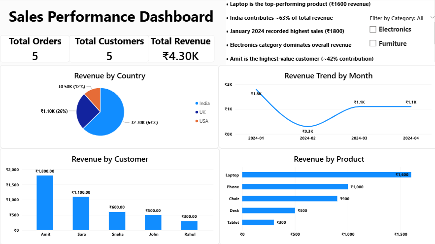

# Sales Performance Dashboard

## 📌 Project Overview
This project analyzes sales data to identify key revenue trends and business insights. An interactive dashboard was built using Power BI to visualize product performance, country-wise sales, and monthly trends.

## 🛠 Tools Used
- SQL
- Excel
- Power BI

## 📊 Key Analysis
- Revenue by Product
- Revenue by Country
- Monthly Revenue Trend
- Top Customers

## 💡 Key Insights
- Laptop is the top-performing product
- India contributes ~63% of total revenue
- January recorded the highest sales
- Electronics category dominates revenue

## 📁 Files Included
- sales_queries.sql → SQL queries used
- sales_data.xlsx → Dataset
- sales_dashboard.pbix → Power BI dashboard
- dashboard.png → Dashboard preview

## 📸 Dashboard Preview
