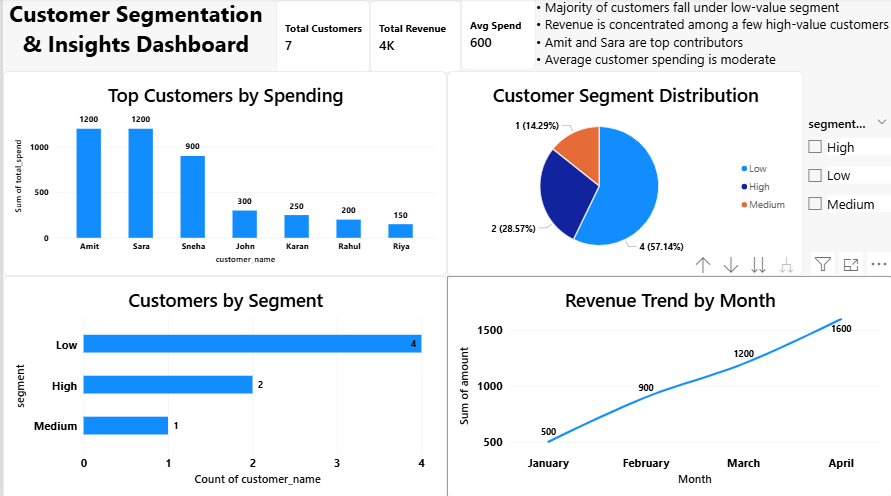

# Customer Segmentation Dashboard

## 📌 Project Overview
This project focuses on analyzing customer spending behavior and segmenting customers into High, Medium, and Low value groups. The dashboard helps identify customer contribution and revenue concentration.

## 🛠 Tools Used
- SQL
- Excel
- Power BI

## 📊 Key Analysis
- Customer Segmentation (High / Medium / Low)
- Top Customers by Spending
- Segment Distribution
- Monthly Revenue Trend

## 💡 Key Insights
- Majority of customers fall under low-value segment
- Revenue is concentrated among a few high-value customers
- Amit and Sara are top contributors
- Average customer spending is moderate

## 📁 Files Included
- customer_segmentation_queries.sql → SQL queries
- customer_data.xlsx → Dataset
- customer_segmentation_dashboard.pbix → Power BI dashboard
- dashboard.png → Dashboard preview

## 📸 Dashboard Preview

